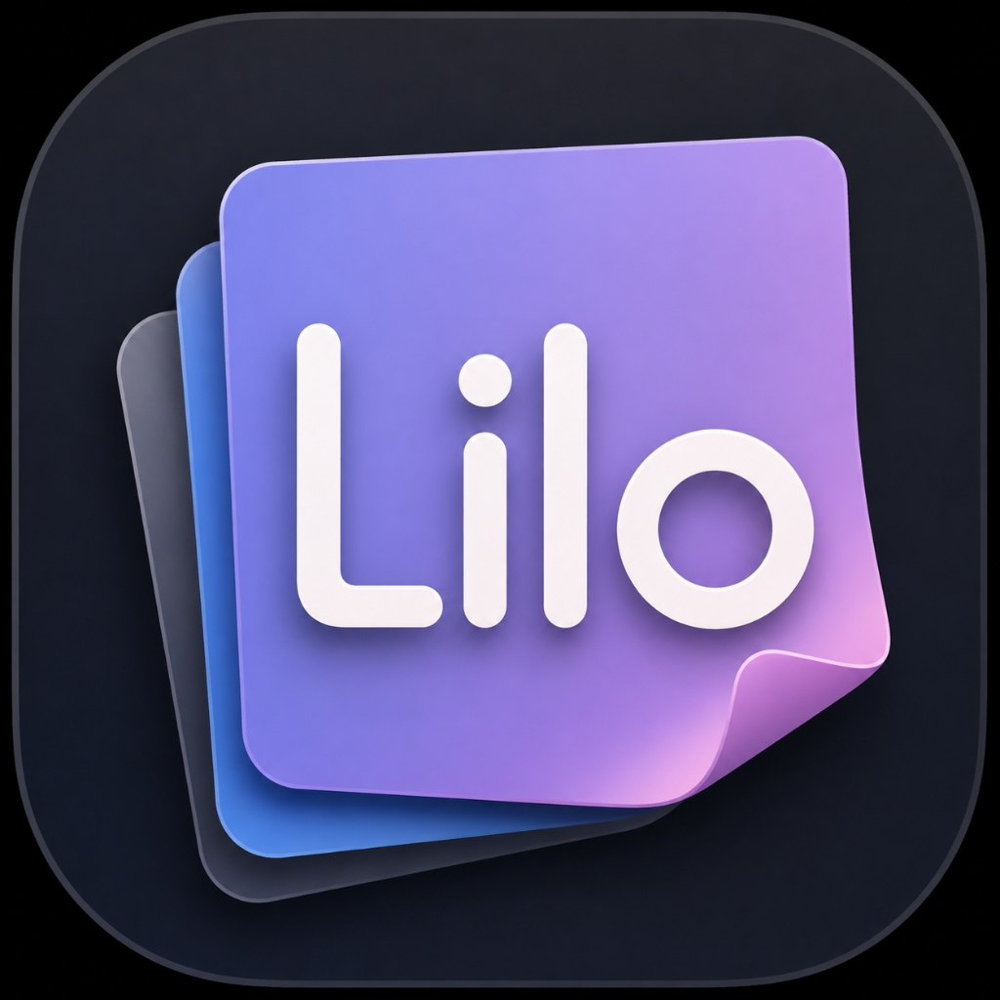
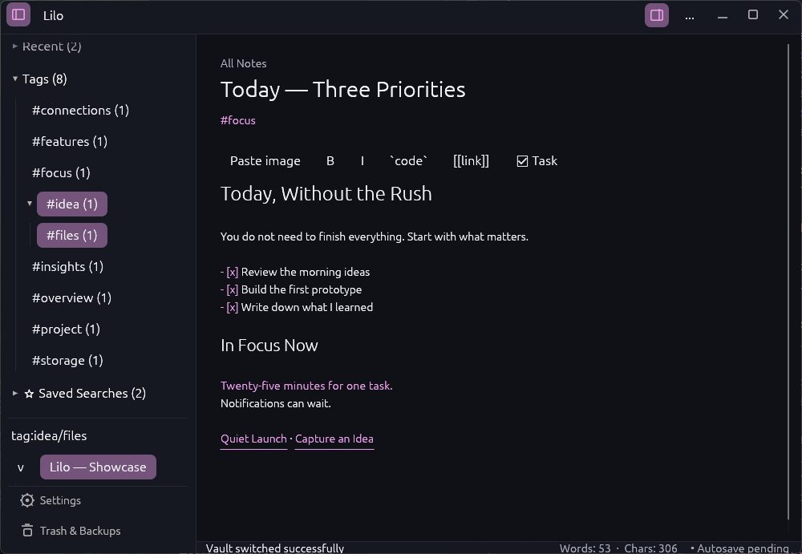
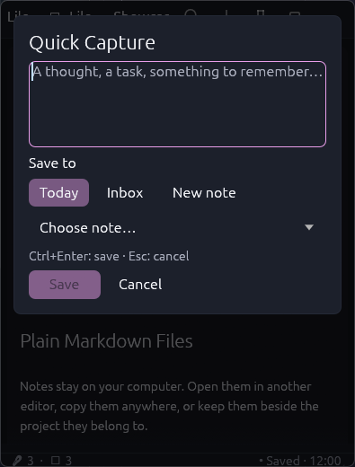
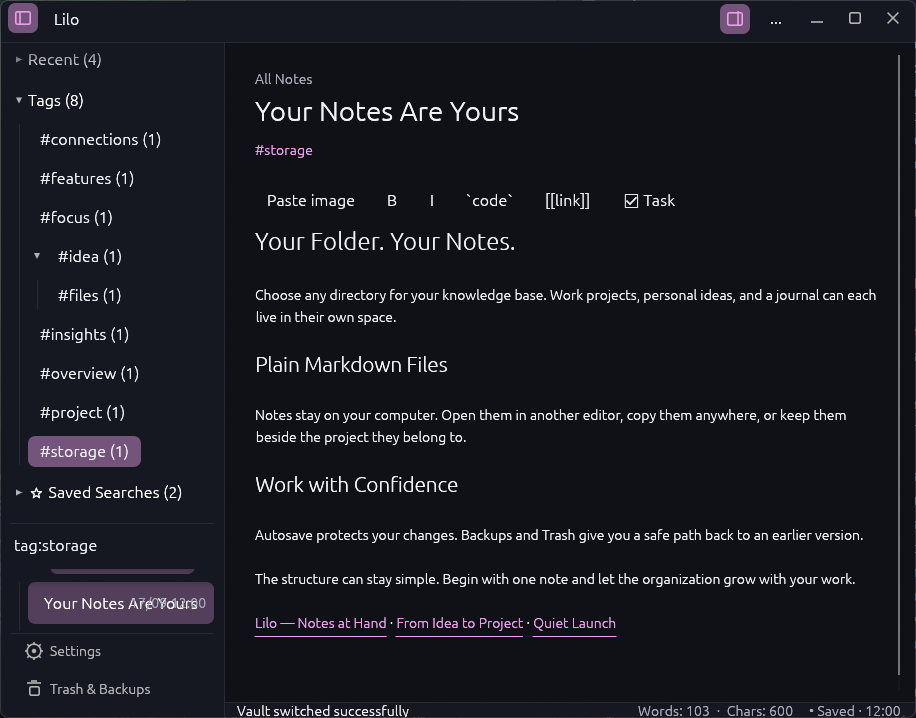
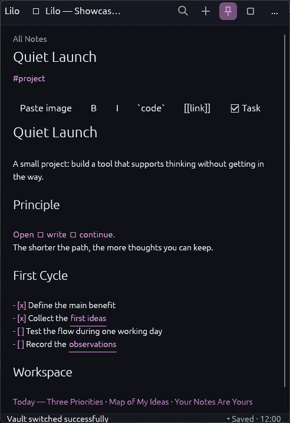

<div align="center">



# Lilo

### Your notes, daily workflow and knowledge graph — in one fast desktop widget.

Lilo is a keyboard-friendly Markdown notebook built with Rust and egui.<br />
It stays compact when you need a quick thought and expands into a complete writing workspace when you need context.

[](https://github.com/HellterEnjoy/Lilo/releases/latest)
[](https://github.com/HellterEnjoy/Lilo/actions/workflows/cross-platform-ci.yml)
[](https://www.rust-lang.org/)
[](#install-lilo)
[](#install-lilo)
[](LICENSE)

[**Download Lilo**](https://github.com/HellterEnjoy/Lilo/releases/latest) · [Features](#everything-you-need-without-leaving-the-widget) · [Build from source](#build-from-source) · [Privacy](PRIVACY.md) · [Roadmap](ROADMAP.md)

<br />



</div>

> [!IMPORTANT]
> **Transparent analytics in v0.2.1**
>
> Lilo uses two separate sources of product statistics:
>
> - **Optional application analytics:** only after explicit consent, Lilo sends a random installation UUID, the local calendar date, the application version and daily numeric counters from a fixed feature whitelist. The counters are sent periodically to a Cloudflare Worker and stored in D1. Analytics can be disabled at any time from Settings, which also queues deletion of that installation's existing rows.
> - **GitHub repository traffic:** a daily GitHub Action archives the repository-level views, unique visitors, clones, referrers and popular paths returned by GitHub's Traffic API. This is separate from the desktop application and contains no Lilo installation identifier.
>
> Lilo does **not** send note contents, titles, filenames, vault paths, tags, aliases, search text, Quick Capture text, wiki-link targets, device identifiers or account details. The Worker does not store request IP addresses in D1.
>
> The complete implementation is public: [desktop whitelist and payload](src/analytics.rs), [Cloudflare Worker](analytics-worker/src/index.js), [D1 schema](analytics-worker/migrations/0001_schema.sql), [GitHub traffic workflow](.github/workflows/collect-traffic.yml) and the full [privacy notice](PRIVACY.md).

<details>
<summary><strong>Exact application feature whitelist (21 counters)</strong></summary>

`note_created`, `daily_note_opened`, `quick_capture_saved`,
`template_note_created`, `template_inserted`, `markdown_formatting_used`,
`search_used`, `saved_search_created`, `command_palette_used`,
`wiki_link_opened`, `graph_opened`, `tag_filter_used`, `attachment_added`,
`note_pinned`, `folder_created`, `trash_restored`, `backup_restored`,
`markdown_imported`, `vault_exported`, `zen_mode_enabled` and
`always_on_top_enabled`.

</details>

## One app, two scales

Lilo is designed around a simple idea: opening a note should not force you into a large, distracting application. Keep it as a small always-on-top widget for quick writing, or expand it into a workspace with your vault explorer, editor and contextual inspector.

<table>
  <tr>
    <td align="center" width="33%">
      
      <br /><strong>Write without leaving the widget</strong>
      <br /><sub>Live Markdown and one-click daily navigation.</sub>
    </td>
    <td align="center" width="33%">
      
      <br /><strong>Capture a thought instantly</strong>
      <br /><sub>Send it to today's note, Inbox or a new note.</sub>
    </td>
    <td align="center" width="33%">
      
      <br /><strong>Keep a daily timeline</strong>
      <br /><sub>Timestamped entries stay in portable Markdown.</sub>
    </td>
  </tr>
</table>

## Everything you need without leaving the widget

| | Area | What Lilo provides |
| --- | --- | --- |
| ✍️ | **Live Markdown** | A single editor instead of separate edit and preview modes, with headings, lists, tasks, links, inline code, fenced code blocks and selection formatting. |
| 📅 | **Daily notes** | Open or create today, move to yesterday or tomorrow, choose the daily folder and use date-based filenames including nested date paths. |
| ⚡ | **Quick Capture** | Record an idea in today's Daily Note, `Inbox.md`, a new timestamped note or a selected custom note. Windows can open capture with a system-wide hotkey. |
| 🧩 | **Templates** | Create notes from regular `.md` templates or insert a template into the current note. No scripts and no proprietary template database. |
| ⌘ | **Command Palette** | Fuzzy-search application commands and run the complete daily, navigation, note, layout and vault workflow from the keyboard. |
| 🔗 | **Connected notes** | Obsidian-style `[[wiki links]]`, aliases, backlinks, unresolved-link inspection, link-preserving note renames and back/forward history. |
| ◉ | **Knowledge graph** | Local, folder and global scopes with filtering, zooming, panning, movable nodes, stable placement and a compact temporary overlay. |
| 🏷️ | **Tags and search** | Hierarchical inline or frontmatter tags, usage counts, clickable filters, saved searches and focused positive or negative search operators. |
| 📎 | **Local attachments** | Paste or drag local images, keep relative Markdown links and inspect unreferenced files without introducing a proprietary media database. |
| 🗂️ | **Vault organisation** | Nested folders, pinning, sorting, aliases and recent-note navigation for a growing collection. |
| 🛟 | **Data safety** | Configurable autosave from 15 seconds to 10 minutes, manual Ctrl+S, save-on-exit, rotating backups, recoverable Trash, external-edit conflict review, diagnostics, import and full-vault export. |
| 🖥️ | **Adaptive workspace** | Compact and expanded layouts, explorer and inspector sidebars, Zen mode, movable toolbar, themes, typography and always-on-top mode. |

## A daily workflow that remains plain Markdown

Open today's note with `Alt+D`. If it does not exist, Lilo creates it; if it already exists, Lilo opens the same file. The Yesterday and Tomorrow controls let you move through the journal without searching the vault manually.

Daily filenames use standard date formatting. They can stay flat:

```text
Daily/2026-08-18.md
```

or be organised into portable nested folders:

```text
Daily/2026/08/18.md
```

Quick Capture adds a timestamped entry without making you switch away from the note you are reading. Its destination is configurable:

- today's daily note;
- `Inbox.md`;
- a new timestamped note;
- a selected custom note.

On Windows, the configurable global shortcut can bring Lilo forward and open Quick Capture even when another application is focused. Linux keeps the in-app shortcut; a system-wide Linux implementation is not included in `0.2.0`.

## Templates without lock-in

Templates are ordinary Markdown files inside the configurable Templates folder. They can be used to create a new note or inserted into the active note.

```markdown
# {{title}}

Created: {{datetime}}

## Focus

{{cursor}}

## Notes
```

Supported variables:

| Variable | Result |
| --- | --- |
| `{{title}}` | Current or newly created note title |
| `{{date}}` | Local date as `YYYY-MM-DD` |
| `{{time}}` | Local time as `HH:MM` |
| `{{datetime}}` | Local date and time |
| `{{yesterday}}` | Previous local calendar date |
| `{{tomorrow}}` | Next local calendar date |
| `{{cursor}}` | Initial cursor position after expansion |

Template frontmatter is not copied over existing note metadata, and templates never execute scripts.

## Find notes by meaning and structure

Simple text search works as expected. When the vault grows, focused operators can be combined:

```text
tag:rust path:"Programming Notes" link:"Ownership" title:"Memory" borrowing
```

| Operator | Matches |
| --- | --- |
| `tag:rust` or `#rust` | Tags, including nested tags such as `rust/ownership` |
| `path:"Daily Notes"` | Folder path |
| `link:"Ownership"` | Outgoing wiki-link target |
| `title:"Memory"` | Note title or alias |
| ordinary words | Searchable note text |

All conditions in a query are applied together, so a broad vault can be narrowed quickly.

Tag filters accept comma-separated values and negation, for example:

```text
tag:rust,learning -tag:archived
```

## Attachments without a media database

Drop an image into the editor or paste a screenshot to copy it into the configurable `Attachments` folder. Lilo inserts a relative Markdown image link and renders PNG, JPEG, GIF, WebP and SVG files inline. Other files can remain ordinary relative Markdown links.

Imported files never silently replace an existing file with the same name. The orphan inspector lists files that are no longer referenced before the user chooses whether to remove them. Attachment paths are constrained to a relative directory inside `Notes` so a cleanup cannot scan outside the vault.

## Markdown-first storage

Lilo stores content as `.md` files with YAML frontmatter. Preferences and interface state stay separately in `settings.json`.

```text
Vault/
├── Notes/
│   ├── Daily/          Daily notes
│   ├── Templates/      Reusable Markdown templates
│   ├── Attachments/    Images and linked local files
│   └── ...             Your own folders and notes
├── Trash/              Recoverable deleted notes
└── Backups/            Rotating note backups
```

There is no embedded note database and no proprietary content format. Notes can be inspected or edited in another text editor; Lilo detects external changes before overwriting a locally modified note. Vault-wide operations create recoverable data where appropriate.

## Keyboard-first control

| Action | Default shortcut |
| --- | --- |
| Command Palette | `Ctrl+P` or `Ctrl+K` |
| Quick Capture | `Ctrl+Shift+C` in-app and system-wide on Windows |
| Back / forward | `Alt+Left` / `Alt+Right` |
| Open today's note | `Alt+D` |
| Create a blank note | `Ctrl+N` |
| Save immediately | `Ctrl+S` |
| Editor / Notes / Graph | `Ctrl+1` / `Ctrl+2` / `Ctrl+3` |
| Recovery / Settings | `Ctrl+4` / `Ctrl+5` |
| Toggle graph overlay | `Ctrl+Shift+G` |
| Toggle explorer / inspector | `Ctrl+B` / `Ctrl+I` |
| Zen writing mode | `F11` |
| Editor zoom | `Ctrl++` / `Ctrl+-` / `Ctrl+0` |
| Close an overlay or return | `Escape` |

Core note, search, graph and save shortcuts can be changed in Settings. The Command Palette also exposes actions that do not need a permanent toolbar button or dedicated shortcut.

## Install Lilo

Download the latest packages and matching SHA-256 files from [GitHub Releases](https://github.com/HellterEnjoy/Lilo/releases/latest).

### Windows

- `Lilo-0.2.1-windows-x64-setup.exe` — per-user installer with a Start menu shortcut; administrator access is not required.
- `Lilo-0.2.1-windows-x64.zip` — portable archive for manual installation.

The current binaries are not code-signed, so Windows SmartScreen may display a warning. WinGet distribution is prepared but remains unavailable until the initial package is accepted into the community repository.

### Linux

- `Lilo-0.2.1-ubuntu-22.04-x86_64.tar.gz` — Ubuntu 22.04 or newer.
- `Lilo-0.2.1-arch-x86_64.tar.gz` — current Arch Linux.

```bash
sha256sum -c Lilo-0.2.1-<platform>-x86_64.tar.gz.sha256
tar -xzf Lilo-0.2.1-<platform>-x86_64.tar.gz
cd Lilo-0.2.1-<platform>-x86_64
install -Dm755 Lilo "$HOME/.local/bin/Lilo"
"$HOME/.local/bin/Lilo"
```

Install the executable in its final location before enabling autostart. Lilo uses the Windows per-user Run registry value or a Linux XDG autostart entry, depending on the platform.

For updating, portable use and recovery instructions, see [RELEASE.md](RELEASE.md).

## Build from source

Install the stable Rust toolchain, then run:

```bash
git clone https://github.com/HellterEnjoy/Lilo.git
cd Lilo
cargo run --release
```

Ubuntu and related distributions also require the native windowing dependencies:

```bash
sudo apt-get update
sudo apt-get install libssl-dev libwayland-dev libxcb-render0-dev \
  libxcb-shape0-dev libxcb-xfixes0-dev libxkbcommon-dev \
  libxkbcommon-x11-dev pkg-config
```

Run the project checks with:

```bash
cargo fmt --all -- --check
cargo test
cargo clippy --all-targets -- -D warnings
```

On Windows, [Inno Setup 6](https://jrsoftware.org/isinfo.php) and `scripts/package-windows.ps1` produce the installer, portable ZIP and SHA-256 files.

## Platform status

| Platform | Status | Distribution |
| --- | --- | --- |
| Windows x86-64 | Supported and tested | Installer and portable ZIP |
| Ubuntu 22.04+ x86-64 | Supported and tested | `.tar.gz` archive |
| Arch Linux x86-64 | Supported and tested | `.tar.gz` archive |
| macOS | Source compatibility is a goal, but currently untested | No official package |

Windows and Ubuntu run formatting, tests and Clippy in CI. Linux releases are currently manual archives rather than native distribution packages.

## Project status

Version `v0.2.1` adds explicit opt-in usage analytics with a public event whitelist, in-app deletion and a separate GitHub traffic archive. Lilo does not yet provide automatic updates, code signing, native Linux packages, a system-wide Linux capture hotkey or an official macOS build. Graph density and expensive live highlighting remain intentionally bounded to keep the widget responsive.

- [Roadmap](ROADMAP.md) — planned product direction;
- [Changelog](CHANGELOG.md) — implemented release history;
- [Release guide](RELEASE.md) — installation, updates and recovery;
- [Performance notes](PERFORMANCE.md) — current performance guardrails.

## Feedback and contributions

Bug reports, feature requests, UI/UX feedback and technical suggestions are welcome through [GitHub Issues](https://github.com/HellterEnjoy/Lilo/issues).

Lilo is intentionally maintained as a single-author project, so code pull requests are not accepted into the official codebase. Forking and modifying the project remains welcome under the license terms. See [CONTRIBUTING.md](CONTRIBUTING.md) for the complete policy.

## License

Lilo is **source-available** under the [PolyForm Noncommercial License 1.0.0](LICENSE).

You may use, study, modify, fork and redistribute Lilo and modified versions for non-commercial purposes, subject to the license terms. Commercial use requires separate permission from the copyright holder. Required copyright, license and attribution notices must remain intact when redistributed.

Copyright © 2026 Kyrylo Yazynin · [github.com/HellterEnjoy/Lilo](https://github.com/HellterEnjoy/Lilo)
